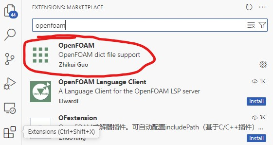
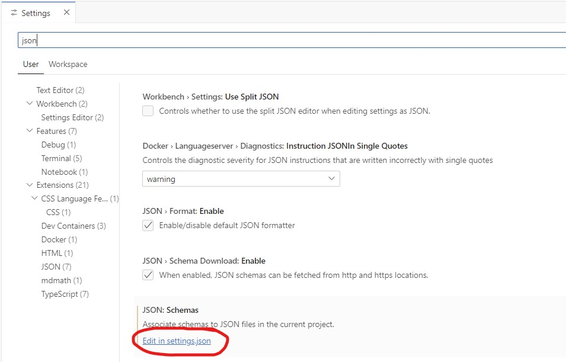
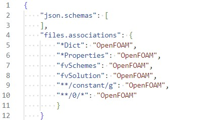
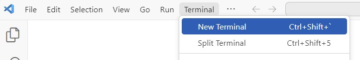
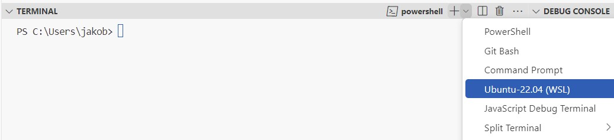
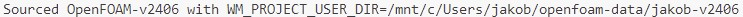
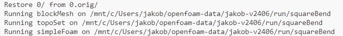

# OpenFOAM Installer

In this guide we will setup OpenFOAM for Windows through Windows Subsystem for Linux (WSL). Linux users may follow this guide as well but skip the steps that are related to WSL. MacOS users should look elsewhere.

## Step 1: Installing Windows Subsystem for Linux (WSL)
**1a)** First, follow the [official guide](https://learn.microsoft.com/en-gb/windows/wsl/install#install-wsl-command) to install WSL. Note that you just need to follow the step "Install WSL command".

**1b)** Go to Microsoft Store and install Ubuntu.

**1c)** Make sure that the two windows features "Virtual Machine Platform" and "Windows Subsystem for Linux" are turned on.  The settings can be found by going to Control Panel > Programs and Features > Turn Windows features on or off.

**1d)** Open the Ubuntu App and go through the installation process, e.g. choose UNIX username and password when prompted. Note that the password remains hidden when you enter it, which is fine.
If the error "WslRegisterDistribution failed with error: 0x80370114" is returned, also enable the feature "Windows Hypervisor Platfrom" in step **1c)**.

## Step 2: Installing Visual Studio Code
**2a)** First, install the text editor [Visual Studio Code](https://code.visualstudio.com).

**2b)** Associate OpenFOAM files by installing the OpenFOAM extension by Zhikui Guo in the left pane.



**2c)** Click the OpenFOAM extension and copy the lines:

```
"files.associations": {
    "*Dict": "OpenFOAM",
    "*Properties": "OpenFOAM",
    "fvSchemes": "OpenFOAM",
    "fvSolution": "OpenFOAM",
    "**/constant/g": "OpenFOAM",
    "**/0/*": "OpenFOAM"
    }
```

**2d)** Open the ``settings.json`` file by going File -> Preferences -> Settings. Then search for ``json`` and edit the ``settings.json`` file.



**2e)** Within this file, add the lines you copied in 2d (leave any content that is already there). Remember to save after you add the lines:



**2f)** Open a new Ubuntu terminal. In the menu choose Terminal -> New terminal.



**2g)** In the newly opened terminal, use the dropdown menu to choose Ubuntu (WSL).



To confirm you opened a WSL terminal a green text should appear:


We should now be ready to install OpenFOAM.

## Step 3: Installing OpenFOAM
The following commands should be entered in the WSL terminal that you opened in step 2g.

**3a)** Open a terminal and add the OpenFOAM repository:
```
curl https://dl.openfoam.com/add-debian-repo.sh | sudo bash 
```
```
sudo apt-get update 
```

**3b)** Install the latest version of OpenFOAM:

```
sudo apt-get install openfoam-default
```

Alternatively, you may choose to install a old specific version, e.g.:
```
sudo apt-get install openfoam2312-default 
```
## Step 4: Set paths for OpenFOAM
Open a Ubuntu (WSL) terminal as you did in step 2g:

**4a)** Copy/paste the following into the terminal to add a function to your ``.bash_aliases`` file:

```
wget https://raw.githubusercontent.com/jakobhaervig/openfoam-installer/main/.bash_aliases -O - >> $HOME/.bash_aliases
```
**4b)** Next, source your ``.bashrc`` file (or reopen the terminal):
```
source $HOME/.bashrc
```

## Step 5: Test OpenFOAM installation by running a tutorial
After having done step 1-4 you are now ready to test the installation.

**5a)** Source OpenFOAM. If you installed the lastest version of OpenFOAM, simply type
```
of
```
If you get an output like the following, OpenFOAM has been sourced correctly and you are now ready to start doing simulations:



If you want another version than the latest, you can type (assume you have installed that version in step 3b:

```
of 2312
```

**5b)** Create a directory for our simulation data:

```
mkdir -p $FOAM_RUN
```

```
run
```

Note, you can see its location by typing:
```
pwd
```

**5c)** Copy a tutorial:

```
cp -r $FOAM_TUTORIALS/incompressible/simpleFoam/squareBend .
```

**5d)** Go to the new folder and run the simulation:

```
cd squareBend
```

```
./Allrun
```

If you get an output like the following, it means the simulation is running:



When it's done you can find the results in your newly created folder, ``C:\Users\jakob\openfoam-data`` (Windows) or ``/home/jakob/openfoam-data`` (Linux).
